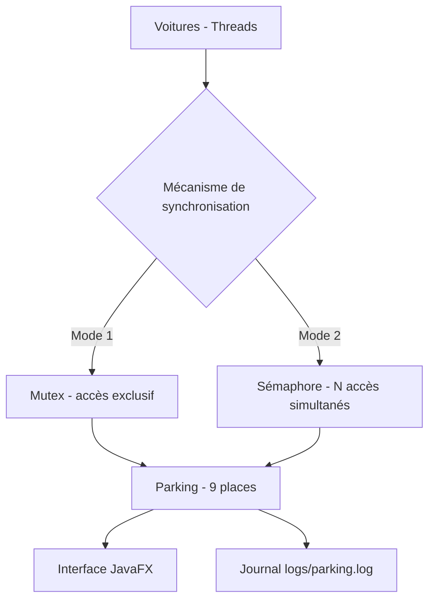
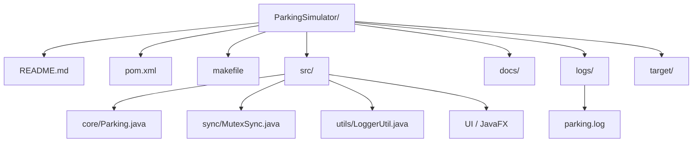
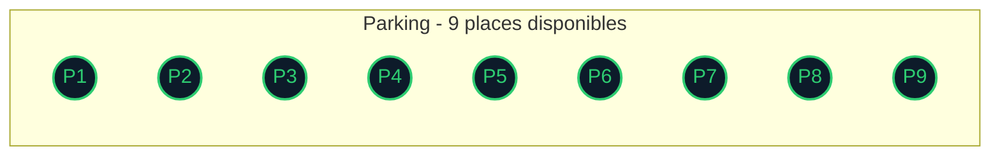
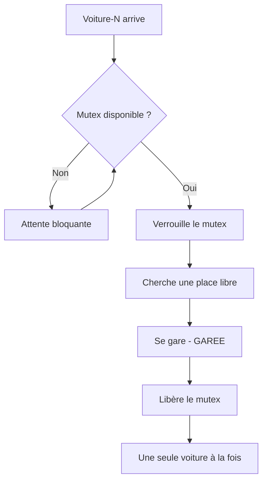
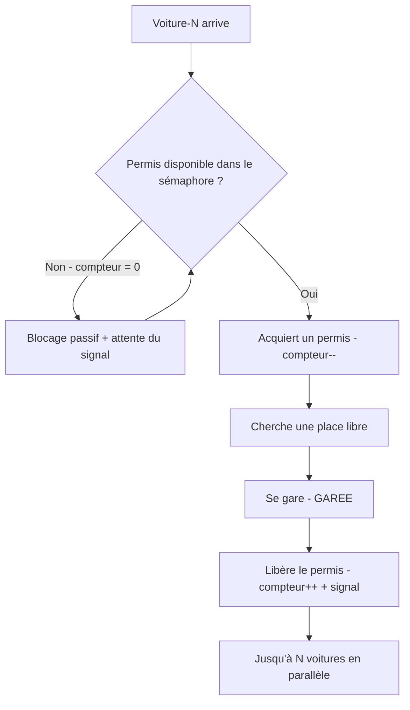
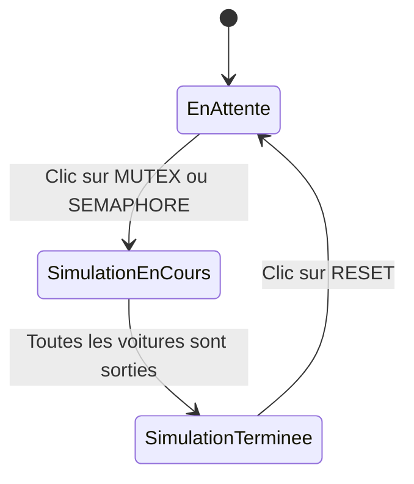
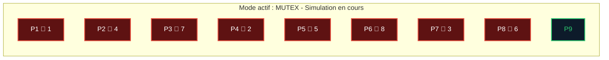
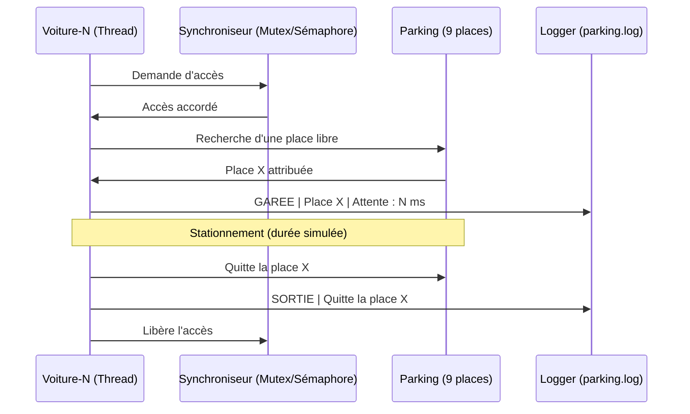
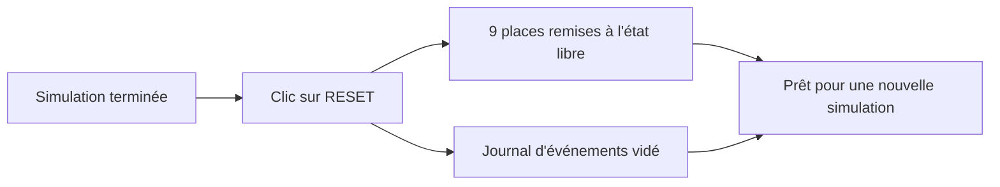

# 🚗 Parking Simulator

**Simulation du Problème de Parking avec Mutex & Sémaphore**

Version `1.0-SNAPSHOT` — Java 21 + JavaFX + Maven

| | |
|---|---|
| **Projet** | Simulateur de Parking – Mini Projet SysAdm |
| **Date** | 14 mai 2026 |
| **Technologies** | Java 21, JavaFX, Apache Maven 3.9.15, Windows 11 |
| **Dépôt GitHub** | https://github.com/youssef-opencodes/ParkingSimulator |

---

## 📑 Sommaire

1. [Introduction](#1-introduction)
2. [Prérequis](#2-prérequis)
3. [Installation & récupération du code source](#3-installation--récupération-du-code-source)
4. [Compilation du projet](#4-compilation-du-projet)
5. [Exécution de la simulation](#5-exécution-de-la-simulation)
6. [Modes de synchronisation](#6-modes-de-synchronisation)
7. [Déroulement d'une simulation](#7-déroulement-dune-simulation)
8. [Journal d'événements (parking.log)](#8-journal-dévénements-parkinglog)
9. [Réinitialisation (Reset)](#9-réinitialisation-reset)
10. [Résolution de problèmes fréquents](#10-résolution-de-problèmes-fréquents)
11. [Résumé des commandes](#11-résumé-des-commandes)

---

## 1. Introduction

Le **Parking Simulator** est une application Java/JavaFX qui illustre la gestion concurrente de ressources partagées dans les systèmes d'exploitation. Il simule des **voitures (threads)** qui tentent de se garer dans un parking à places limitées, en utilisant deux mécanismes de synchronisation : le **Mutex** et le **Sémaphore**.

Ce guide explique comment installer, compiler, exécuter et interpréter les résultats de la simulation.

### Architecture générale



---

## 2. Prérequis

### Logiciels requis

| Outil | Version / Remarque |
|---|---|
| **Java JDK 21** | Oracle JDK 21.0.9 (LTS) — `java -version` doit afficher `21.x` |
| **Apache Maven 3.9+** | Maven 3.9.15 — `mvn -version` doit afficher `3.9.x` |
| **Git** | Pour cloner le dépôt depuis GitHub |
| **Windows 11 / Linux / macOS** | Compatible toutes plateformes Java |

### Vérification

```bash
java -version
```
```
java version "21.0.9" 2025-10-21 LTS
Java(TM) SE Runtime Environment (build 21.0.9+7-LTS-338)
Java HotSpot(TM) 64-Bit Server VM (build 21.0.9+7-LTS-338, mixed mode, sharing)
```

```bash
mvn -version
```
```
Apache Maven 3.9.15 (98b2cdbfdb5f1ac8781f537ea9acccaed7922349)
Maven home: C:\Program Files\apache-maven-3.9.15
Java version: 21.0.9, vendor: Oracle Corporation, runtime: C:\Program Files\Java\jdk-21
Default locale: fr_FR, platform encoding: UTF-8
OS name: "windows 11", version: "10.0", arch: "amd64", family: "windows"
```

---

## 3. Installation & récupération du code source

### 3.1 Cloner le dépôt Git

Ouvrez un terminal (PowerShell, Git Bash ou terminal Linux) et exécutez :

```bash
git clone https://github.com/youssef-opencodes/ParkingSimulator.git
cd ParkingSimulator
```

### 3.2 Mettre à jour le code (git pull)

Si le dépôt est déjà cloné, synchronisez-le avec la dernière version :

```bash
git pull
```

Exemple de résultat (7 fichiers modifiés, nouvelle branche détectée) :

```
remote: Enumerating objects: 83, done.
remote: Counting objects: 100% (82/82), done.
remote: Compressing objects: 100% (32/32), done.
remote: Total 66 (delta 19), reused 64 (delta 17), pack-reused 0 (from 0)
Unpacking objects: 100% (66/66), 14.47 KiB | 54.00 KiB/s, done.
   566ed20..a851bb3  main          -> origin/main
 * [new branch]      interface-dynamique -> origin/interface-dynamique
Fast-forward
 .gitignore                                              |  3 -
 docs/Guide_Utilisation.md                               |  0
 logs/parking.log                                        |  0
 makefile                                                | 26 ++++++++
 .../com/example/ParkingSimulator/core/Parking.java      | 13 ++++
 .../example/ParkingSimulator/sync/MutexSync.java        | 10 +++-
 .../example/ParkingSimulator/utils/LoggerUtil.java      | 70 ++++++++++++++++
 7 files changed, 118 insertions(+), 4 deletions(-)
```

### 3.3 Structure du projet

```
ParkingSimulator/
├── README.md          # Documentation rapide du projet
├── pom.xml             # Configuration Maven (dépendances JavaFX, plugins)
├── makefile            # Raccourcis de compilation et d'exécution
├── src/                # Code source Java (Parking.java, MutexSync.java, LoggerUtil.java, UI…)
├── docs/               # Documentation technique et guide d'utilisation
├── logs/               # Fichier parking.log généré après chaque simulation
└── target/             # Répertoire de build (généré par Maven)
```



---

## 4. Compilation du projet

Placez-vous à la racine du projet (répertoire contenant `pom.xml`) et lancez :

```bash
mvn clean compile
```

Cette commande nettoie le répertoire `target/` précédent, recompile les **11 fichiers source Java** et copie les ressources. En cas de succès, Maven affiche `BUILD SUCCESS`.

```
[INFO] --- clean:3.2.0:clean (default-clean) @ ParkingSimulator ---
[INFO] Deleting C:\...\SysAdm\target
[INFO] --- resources:3.4.0:resources (default-resources) @ ParkingSimulator ---
[INFO] --- compiler:3.11.0:compile (default-compile) @ ParkingSimulator ---
[INFO] Compiling 11 source files with javac [debug release 21 module-path] to target\classes
[INFO] BUILD SUCCESS
[INFO] Total time:  2.411 s
```

> **Note :** Les avertissements (`WARNING`) concernant `org.openjfx:javafx-controls` sont bénins et n'empêchent pas la compilation.

---

## 5. Exécution de la simulation

### 5.1 Lancer l'application

Depuis la racine du projet, exécutez :

```bash
mvn javafx:run
```

Cela copie les ressources, vérifie qu'aucune recompilation n'est nécessaire, puis lance l'interface graphique.

### 5.2 Interface principale

Au démarrage, l'interface affiche un parking de **9 places (P1 à P9)**, toutes disponibles (fond sombre avec bordure verte). Le statut affiche **"En attente..."** jusqu'au démarrage d'une simulation.



Boutons disponibles : **▶ MUTEX** (vert), **▶ SEMAPHORE** (bleu), **⟳ RESET** (grisé tant qu'aucune simulation n'est terminée).

---

## 6. Modes de synchronisation

L'application propose deux mécanismes de synchronisation pour contrôler l'accès concurrent aux places.

### 6.1 Mode MUTEX

Cliquez sur le bouton **▶ MUTEX** (vert) pour démarrer la simulation en mode Mutex. Un mutex (**MUT**ual **EX**clusion) garantit qu'une seule voiture à la fois peut accéder à la section critique de gestion des places. Les voitures s'exécutent en séquence pour l'accès au parking, évitant tout conflit.



### 6.2 Mode SÉMAPHORE

Cliquez sur le bouton **▶ SEMAPHORE** (bleu) pour démarrer en mode Sémaphore. Un sémaphore compteur autorise jusqu'à **N voitures simultanément** (N = nombre de places libres). Ce mode est généralement plus performant car il permet plus de parallélisme.



### 6.3 Comparatif

| Critère | MUTEX | SÉMAPHORE |
|---|---|---|
| **Parallélisme** | Faible (accès exclusif) | Élevé (N accès simultanés) |
| **Attente** | Active (spin-lock possible) | Passive (blocage + signal) |
| **Utilisation CPU** | Plus élevée | Plus faible |
| **Simplicité** | Simple à implémenter | Légèrement plus complexe |

---

## 7. Déroulement d'une simulation

### 7.1 Cycle de vie de la simulation



### 7.2 Simulation en cours

Pendant la simulation, les places occupées s'affichent en **rouge** avec le numéro de la voiture garée. La ou les places encore disponibles restent avec une bordure **verte**. Le journal d'événements en bas de fenêtre liste en temps réel les arrivées (`Voiture-N → place X`) avec leur temps d'attente.



### 7.3 Cycle de vie d'une voiture (thread)



### 7.4 Fin de simulation

Lorsque toutes les voitures ont quitté le parking, le message **"✔ Simulation terminée !"** s'affiche. Toutes les places redeviennent disponibles (fond sombre). Le bouton **RESET** devient actif pour relancer une nouvelle simulation.

---

## 8. Journal d'événements (parking.log)

Chaque simulation génère automatiquement un fichier `logs/parking.log`. Ce fichier contient l'historique complet de la simulation avec horodatage précis.

### Format d'une entrée de log

```
[2026-05-14 20:39:22] Voiture-1 | GAREE  | Place 0 | Attente : 0 ms
[2026-05-14 20:39:24] Voiture-1 | SORTIE | Quitte la place 0
```

### Champs du journal

| Champ | Description |
|---|---|
| `[timestamp]` | Date et heure précises de l'événement |
| `Voiture-N` | Identifiant de la voiture (thread) |
| `GAREE / SORTIE` | Action : stationnement réussi ou départ |
| `Place X` | Numéro de la place utilisée (0 à 8) |
| `Attente : X ms` | Temps attendu avant de trouver une place libre |

### Exemple — Simulation complète en mode MUTEX (32 événements, 9 places, 15 voitures)

```
[2026-05-14 20:39:22] SIMULATION | Mode : MUTEX | Places : 9 | Voitures : 0
[2026-05-14 20:39:22] -------------------------------------------------
[2026-05-14 20:39:22] Voiture-1  | GAREE  | Place 0 | Attente : 0 ms
[2026-05-14 20:39:22] Voiture-2  | GAREE  | Place 3 | Attente : 0 ms
[2026-05-14 20:39:22] Voiture-3  | GAREE  | Place 6 | Attente : 0 ms
[2026-05-14 20:39:22] Voiture-4  | GAREE  | Place 1 | Attente : 0 ms
[2026-05-14 20:39:23] Voiture-5  | GAREE  | Place 4 | Attente : 1 ms
[2026-05-14 20:39:23] Voiture-6  | GAREE  | Place 7 | Attente : 0 ms
[2026-05-14 20:39:23] Voiture-7  | GAREE  | Place 2 | Attente : 0 ms
[2026-05-14 20:39:24] Voiture-8  | GAREE  | Place 5 | Attente : 0 ms
[2026-05-14 20:39:24] Voiture-9  | GAREE  | Place 8 | Attente : 0 ms
[2026-05-14 20:39:24] Voiture-1  | SORTIE | Quitte la place 0
[2026-05-14 20:39:24] Voiture-10 | GAREE  | Place 0 | Attente : 0 ms
[2026-05-14 20:39:25] Voiture-2  | SORTIE | Quitte la place 3
[2026-05-14 20:39:25] Voiture-11 | GAREE  | Place 3 | Attente : 643 ms
[2026-05-14 20:39:26] Voiture-4  | SORTIE | Quitte la place 1
[2026-05-14 20:39:26] Voiture-13 | GAREE  | Place 1 | Attente : 747 ms
[2026-05-14 20:39:26] Voiture-3  | SORTIE | Quitte la place 6
[2026-05-14 20:39:26] Voiture-14 | GAREE  | Place 6 | Attente : 489 ms
[2026-05-14 20:39:27] Voiture-10 | SORTIE | Quitte la place 0
[2026-05-14 20:39:27] Voiture-15 | GAREE  | Place 0 | Attente : 813 ms
[2026-05-14 20:39:27] Voiture-6  | SORTIE | Quitte la place 7
[2026-05-14 20:39:27] Voiture-12 | GAREE  | Place 7 | Attente : 2209 ms
[2026-05-14 20:39:28] Voiture-5  | SORTIE | Quitte la place 4
[2026-05-14 20:39:28] Voiture-8  | SORTIE | Quitte la place 5
[2026-05-14 20:39:28] Voiture-13 | SORTIE | Quitte la place 1
[2026-05-14 20:39:28] Voiture-7  | SORTIE | Quitte la place 2
[2026-05-14 20:39:29] Voiture-9  | SORTIE | Quitte la place 8
[2026-05-14 20:39:29] Voiture-15 | SORTIE | Quitte la place 0
[2026-05-14 20:39:30] Voiture-12 | SORTIE | Quitte la place 7
[2026-05-14 20:39:30] Voiture-14 | SORTIE | Quitte la place 6
[2026-05-14 20:39:30] Voiture-11 | SORTIE | Quitte la place 3
```

> 📊 **Analyse :** Ce journal montre une simulation MUTEX avec 9 places et 15 voitures. Les 9 premières voitures se garent instantanément (`Attente : 0 ms`). Les voitures suivantes attendent jusqu'à **2209 ms** qu'une place se libère.

---

## 9. Réinitialisation (Reset)

Après la fin d'une simulation, cliquez sur le bouton **⟳ RESET** pour remettre le parking à l'état initial :

- Toutes les places redeviennent libres (bordure verte)
- Le journal d'événements est vidé
- Vous pouvez relancer une nouvelle simulation en mode **MUTEX** ou **SÉMAPHORE**



---

## 10. Résolution de problèmes fréquents

| Problème | Solution |
|---|---|
| `mvn` : commande introuvable | Maven n'est pas dans le `PATH`. Ajoutez `C:\Program Files\apache-maven-3.9.15\bin` dans les variables d'environnement système. |
| `java` : version incorrecte | Vérifiez que `JAVA_HOME` pointe vers le JDK 21. Exécutez `java -version` pour confirmer. |
| `BUILD FAILURE` à la compilation | Exécutez `mvn clean compile -X` pour voir les erreurs détaillées. Vérifiez que `pom.xml` est bien présent. |
| Fenêtre JavaFX ne s'ouvre pas | Vérifiez que JavaFX est bien configuré dans `pom.xml` (`openjfx 21.0.1`). Essayez `mvn clean package` puis relancez. |
| Fichier `parking.log` vide | Lancez la simulation complètement (jusqu'à "Simulation terminée"). Le log n'est écrit qu'à la fin de chaque événement. |

---

## 11. Résumé des commandes

| Commande | Description |
|---|---|
| `git clone <url>` | Cloner le dépôt pour la première fois |
| `git pull` | Synchroniser avec les dernières modifications |
| `mvn clean compile` | Nettoyer et recompiler le projet |
| `mvn javafx:run` | Lancer l'interface graphique |
| `mvn clean package` | Créer le JAR exécutable dans `target/` |
| `mvn test` | Lancer les tests unitaires |

---

<p align="center"><i>Parking Simulator v1.0 — Mini Projet SysAdm 2026</i></p>
